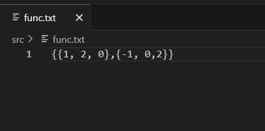

# Grapher-3D

This program will render a 3D polynomial function of your choice.

## How to use
In order to set your interested polynom as input, you have to open func.txt file to edit it.

A valid input should be one line array {} with elements of the following format:

`{coefficient , X-power, Y-power}`

So in the example above you get the polynom: `X^2-Y^2`

Then click on run to open the rendered 3d-graph.

Now you can use arraws keys for rotation control and use the +/- buttons for zoom in/out.

Look at the legend on right bottom to understand the XYZ axis directions. 

## Notes
1. This idea works also with anoter types of functions(not polynomial only), but in the polynomial case is much easier to get input(as shown above).
2. To get more accurate and continious shape, you need to increase the base plain size(getMishor method input).

## Running the program
In order to run this app:
* Install Processing software.
* Open src folder and click on run button.